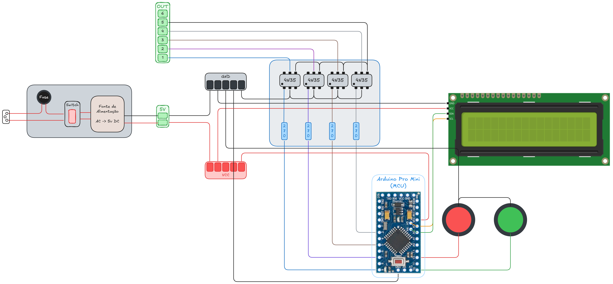
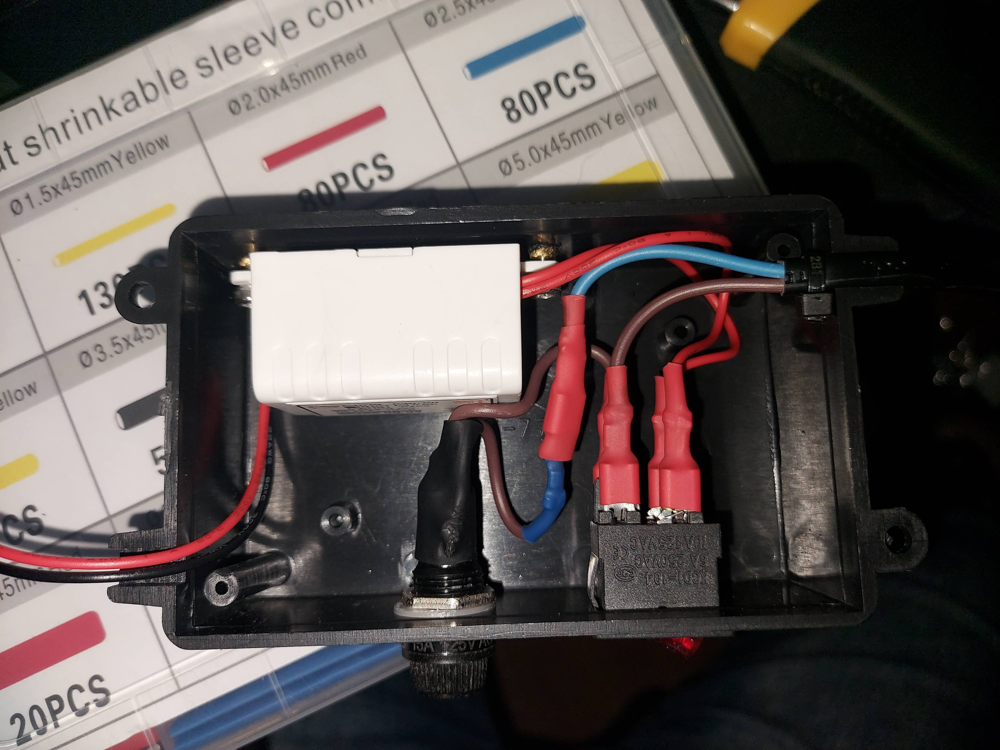
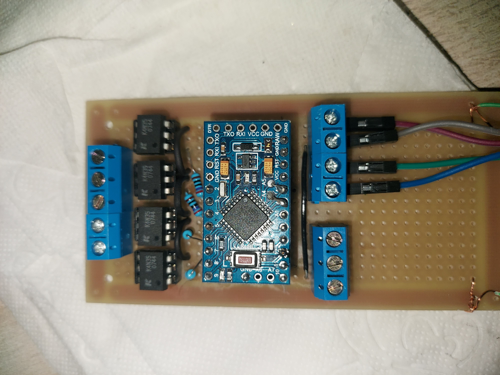
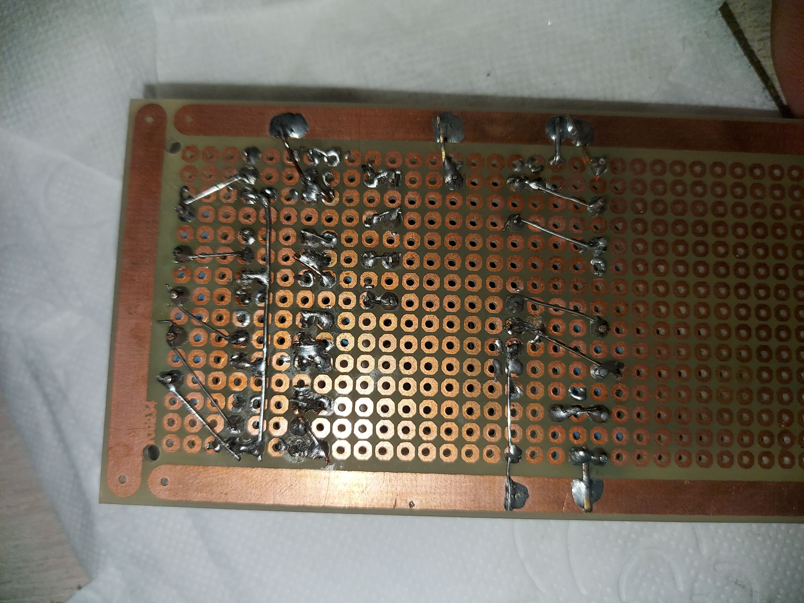
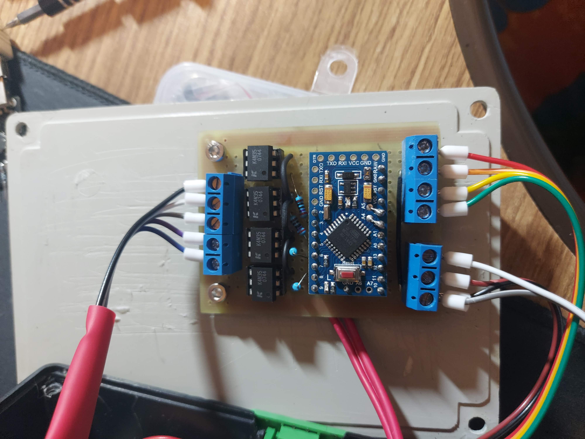
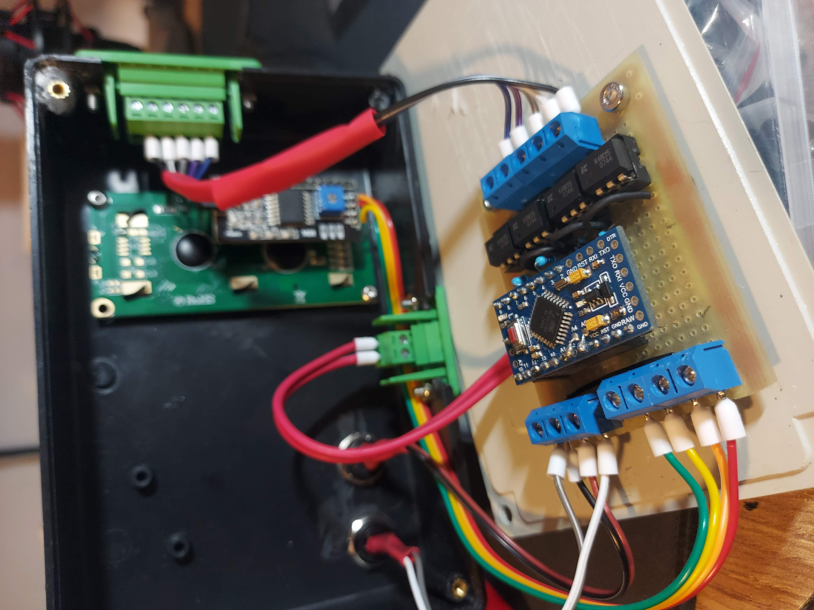
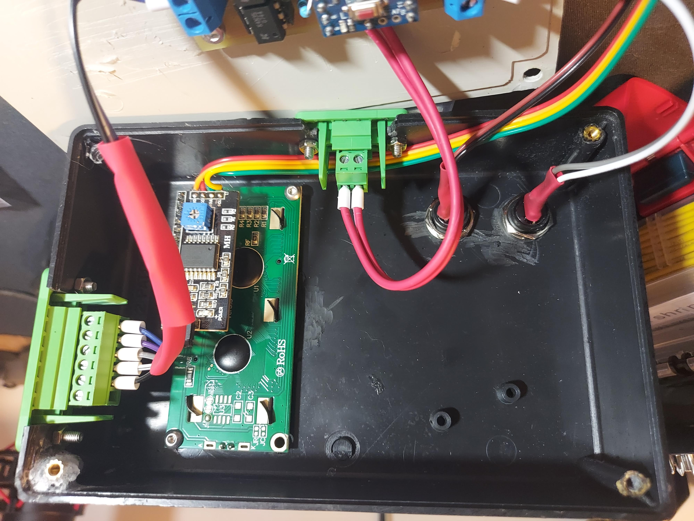

# WegInverterController

Controlador para o Inversor de Frequencia WEG CFW100 v4.21

## Configuração

| Parâmetro | Valor | Comentário                                                  |
| --------- | ----- | ----------------------------------------------------------- |
| P002      | 35.0  | Define a referência de velocidade do motor                  |
| P100      | 210.0 | Tempo da rampa de subida no primeiro sentido                |
| P101      | 60.0  | Tempo da rampa de descida no primeiro sentido               |
| P102      | 60.0  | Tempo da rampa de subida no segundo sentido                 |
| P103      | 50.0  | Tempo da rampa de descida no segundo sentido                |
| P105      | 2     | Define a seleção de rampa para as portas digitais           |
| P107      | 5.0   | Tempo da rampa de descida de emergencia (parada rápida)     |
| P133      | 3.0   | Frequência mínima do motor                                  |
| P134      | 35.0  | Frequência máxima do motor                                  |
| P136      | 5.0   | Boost de torque manual                                      |
| P142      | 100.0 | Tensão maxima de saída                                      |
| P145      | 35.0  | Frequência máxima de saída                                  |
| P202      | 0     | Modo do inversor V/f escalar                                |
| P220      | 4     | Define a seleção de fonte para as portas digitais           |
| P223      | 4     | Define a seleção de giro para as portas digitais            |
| P224      | 1     | Define a seleção de gira/para para as portas digitais       |
| P263      | 1     | Define a porta D1 como função Gira/Para                     |
| P264      | 8     | Define a porta D2 como função de mudança do Sentido de Giro |
| P265      | 14    | Define a porta D3 como função de mudança de Rampa           |
| P266      | 3     | Define a porta D4 como função de Parada Rápida (Emergência) |

## Diagrama

  

- Excalidraw: [WegControllerDiagram.excalidraw](Docs/WegControllerDiagram.excalidraw)

## Fotos

### Fonte de Alimentação

  

### PCB

<table>
  <tr>
    <td align="center">
      
    </td>
    <td align="center">
      
    </td>
  </tr>
</table>

### Montagem

<table>
  <tr>
    <td align="center">
      
    </td>
    <td align="center">
      
    </td>
  </tr>
  <tr>
    <td colspan="2" align="center">
      
    </td>
  </tr>
</table>
